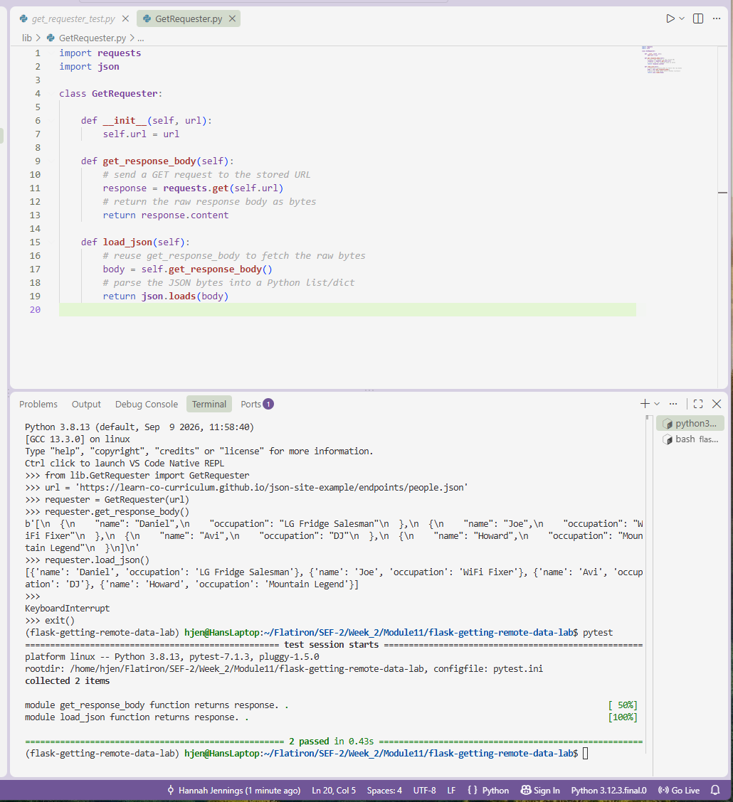

# Getting Remote Data Lab
**Completed Sept 14, 2026**

## Description

This project implements a `GetRequester` class that retrieves remote JSON data over HTTP. Given a URL on initialization, the class can:

- Send a GET request to that URL and return the raw response body (`get_response_body`)
- Convert that response body into usable Python data structures like lists and dictionaries (`load_json`)

It's a small, reusable pattern for pulling and parsing JSON from any remote API endpoint.

## Screenshot



## Installation

1. Clone this repository:
   ```
   git clone <your-fork-url>
   cd flask-getting-remote-data-lab
   ```
2. Install dependencies:
   ```
   pipenv install
   ```
3. Activate the virtual environment:
   ```
   pipenv shell
   ```

## Usage

```python
from lib.GetRequester import GetRequester

url = 'https://learn-co-curriculum.github.io/json-site-example/endpoints/people.json'
requester = GetRequester(url)

# raw response body as bytes
requester.get_response_body()

# parsed JSON as a Python list of dicts
requester.load_json()
```

`get_response_body` sends a GET request to the URL passed in on initialization and returns the raw response content as bytes. `load_json` reuses `get_response_body` and parses those bytes into native Python data (lists/dicts) using the `json` module.

## Testing

Run the test suite with:

```
pytest
```

Tests live in `lib/testing/get_requester_test.py` and verify both that the raw response is returned correctly and that it's parsed into the expected data structure.

## Tools and Resources

- [GET - Mozilla](https://developer.mozilla.org/en-US/docs/Web/HTTP/Methods/GET)
- [HTTP methods - Mozilla](https://developer.mozilla.org/en-US/docs/Web/HTTP/Methods)
- [requests](https://requests.readthedocs.io/en/latest/)
- [Python JSON](https://docs.python.org/3/library/json.html)

## Grading Criteria

The application passes all test suites:
- Get JSON data
- Convert to JSON